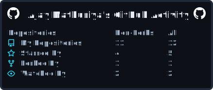
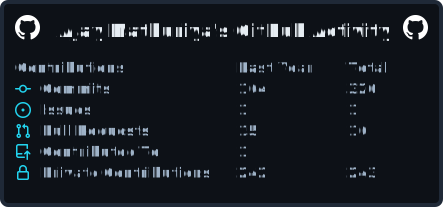
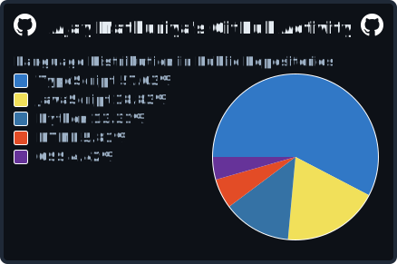

  

  

<h1 align="center">AjayCodesItBetter</h1>

  
  
  

  Building, learning, and improving one project at a time.

## ⚡ About Me

Hey, I'm Ajay — an AI/ML student and developer who enjoys building practical projects across AI, data, and cloud. I like turning ideas into working systems and improving through consistent iteration.

> "I apply intensity to both code and curls."

---

## 🔍 Quick Facts

- 🧠 2nd Year AI/ML Student @ Shriram College
- 🔍 Minor in AI from IIT Ropar
- 📚 Interested in philosophy — especially Franz Kafka and Dostoevsky
- ❤‍🔥 Check out my [Dating Portfolio](https://ajaydoesitbetter.netlify.app)

---

## 🚀 GitHub Stats

  

  

  

